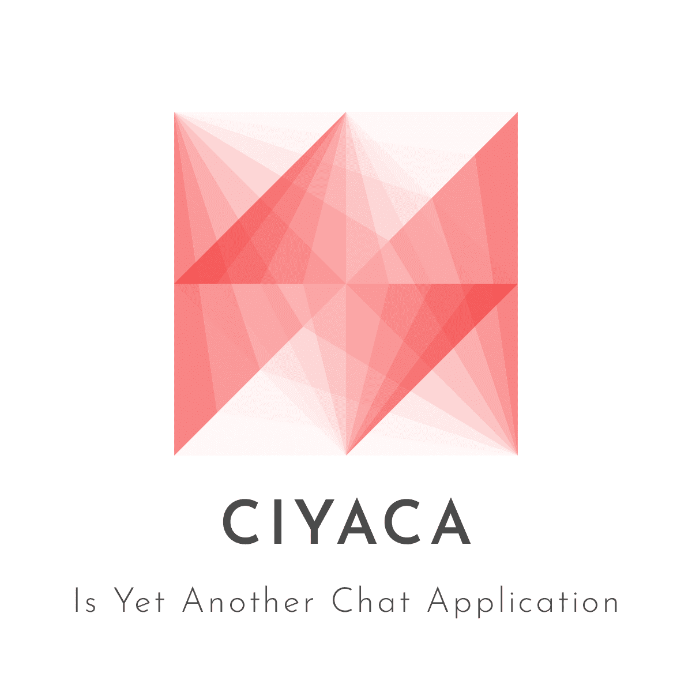

<p align="center">
  <a href="https://github.com/ciyaca/ciyaca/">
    
  </a>
  
<!-- PROJECT SHIELDS -->

<div align="center">

[![Contributors][contributors-shield]][contributors-url]
[![Forks][forks-shield]][forks-url]
[![Stargazers][stars-shield]][stars-url]
[![Issues][issues-shield]][issues-url]
[![GPL-3.0][license-shield]][license-url]
</div>

<!-- PROJECT LOGO -->

  <h3 align="center">CIYACA</h3>
  <p align="center">
    CIYACA Is Yet Another Chat APP!
    <br/>
    CIYACA 是为北京理工大学《2020年春季Linux 系统编程》大作业而开发的聊天+ BBS 软件， 包括服务端和客户端，均采用 C/CPP 实现。
    <br />
    <a href="https://ciyaca.github.io/"><strong>探索本项目的在线文档（为 PDF 文档的在线版本，实际上 PDF 版本效果更加） »</strong></a>
    <br />
    <br />
    <a href="https://github.com/ciyaca/ciyaca/">查看Demo</a>
    ·
    <a href="https://github.com/ciyaca/ciyaca/issues">报告Bug</a>
    ·
    <a href="https://github.com/ciyaca/ciyaca/issues">提出新特性</a>
  </p>

</p>

## 目录

[toc]

### 编译环境和使用方式

###### 编译环境

###### 使用方式

###### 开发前的配置要求

###### **安装步骤**

2. Clone the repo

```sh
git clone https://github.com/shaojintian/Best_README_template.git
```

### 文件目录说明
eg:

```
filetree 
├── ARCHITECTURE.md
├── LICENSE.txt
├── README.md
├── /account/
├── /bbs/
├── /docs/
│  ├── /rules/
│  │  ├── backend.txt
│  │  └── frontend.txt
├── manage.py
├── /oa/
├── /static/
├── /templates/
├── useless.md
└── /util/

```


### 基本功能

| 功能名称       | 功能介绍                                                     |
| :------------- | :----------------------------------------------------------- |
| 联系人树状显示 | 将所有联系人按照好友与群组分成两类以树状结构进行呈现。       |
| 好友请求处理   | 主要用于处理好友申请，选择同意或拒绝，并与服务器完成信息交互后删除该请求。 |
| 单聊           | 进行单人聊天。                                               |
| 历史消息       | 登录后，服务端会将历史消息发送至客户端，客户端重新渲染聊天记录。 |
| 表情包发送     | 可发送动态表情包。                                           |
| 文件发送       | 可发送图片等文件，发送时聊天界面中间有进度条显示进度。       |
| 添加好友/群组  | 输入好友名称或群组名称，服务器将返回处理结果，存在该用户则可发送好友请求。 |
| 创建群组       | 输入群组名称，服务器查询无重复即可创建群组。                 |
| 群聊           | 进行群组聊天。                                               |
| BBS 发帖       | 可进行论坛聊天。                                             |
| BBS 评论       | 可进行论坛评论。                                             |
| BBS 文件上传   | 可以上传文件到论坛。                                         |
| BBS 文件下载   | 可以从论坛上下载文件。                                       |


### 特色与创新之处

- 专门设计了 Logo、名称
- 采用 Github 进行团队协作
- 采用 Sphinx + reStructuredText 进行文档写作
- 采用石墨文档进行共享编辑、整理前期内容
- 设计了美观的界面
  - 有聊天气泡
- 使用了 RPC 的方式封装了底层通信，提供耦合度极低的双向调用方式

### 技术栈

- 本项目使用 C++ 进行开发，使用 MySQL 数据库。
- 使用 Qt5 作为客户端
- [msgpack](https://github.com/msgpack/msgpack)
- [libmysqlclient](https://dev.mysql.com/downloads/c-api/)

### 贡献者以及项目分工

### 分工

| 姓名   | 学号       | 分工                                                         |
| :----- | :--------- | :----------------------------------------------------------- |
| 董斌   | 1120173585 | 负责客户端界面的设计和客户端的开发工作，相关文档撰写         |
| 冯开宇 | 1120171224 | 负责网络通信框架FeverRPC-ng 的开发和维护，相关文档撰写和文档排版，以及项目计划的制定和督促工作 |
| 李昌昊 | 1120173304 | 李昌昊负责数据库的设计与建立，以及相关Mysql语句编写，相关文档撰写 |
| 王占坤 | 1120170124 | 负责部分客户端界面的开发和全部客户端接口的编写工作，相关文档撰写 |
| 张剑威 | 1120173586 | 张剑威负责后端接口的编写以及各个成员之间的协调工作           |

### 合作

我们小组在项目开始通过小组会议的方式实现了对项目的大体分工。

在确定好分工后，会定期开展会议来分享大家的进度以及遇到的问题。同时，小组内部部分成员会不定期讨论来决定一些细节问题，比如接口设计问题，并通过及时沟通解决开发上遇到的冲突。我们项目实现了成员职责的明确界定，项目的每个部分都有对应的负责人。我们重视人际协调和沟通，每个人遇到问题，我们大家都会想办法一起解决。通过我们良好的人员合作，我们最终圆满完成了这个项目。

### 版本控制

该项目使用Git进行版本管理。您可以在 [repository](https://github.com/ciyaca/ciyaca) 参看当前可用版本。


### 版权说明

该项目签署了GPL-3.0 授权许可，详情请参阅 [LICENSE.txt](https://github.com/shaojintian/Best_README_template/blob/master/LICENSE.txt)

### 鸣谢


- [buttonrpc](https://github.com/button-chen/buttonrpc_cpp14)
- [Img Shields](https://shields.io)
- [Choose an Open Source License](https://choosealicense.com)
- [GitHub Pages](https://pages.github.com)

<!-- links -->

[your-project-path]:ciyaca/ciyaca
[contributors-shield]: https://img.shields.io/github/contributors/ciyaca/ciyaca.svg?style=flat-square
[contributors-url]: https://github.com/ciyaca/ciyaca/graphs/contributors
[forks-shield]: https://img.shields.io/github/forks/ciyaca/ciyaca.svg?style=flat-square
[forks-url]: https://github.comciyaca/ciyaca/network/members
[stars-shield]: https://img.shields.io/github/stars/ciyaca/ciyaca.svg?style=flat-square
[stars-url]: https://github.com/ciyaca/ciyaca/stargazers
[issues-shield]: https://img.shields.io/github/issues/ciyaca/ciyaca.svg?style=flat-square
[issues-url]: https://github.com/ciyaca/ciyaca/issues/new
[license-shield]:https://flat.badgen.net/github/license/ciyaca/ciyaca
[license-url]: https://github.com/ciyaca/ciyaca/blob/master/LICENSE


